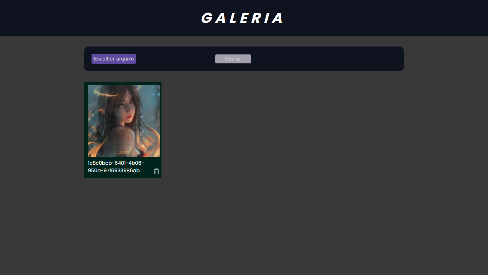

 
 

# Projeto
Projeto de uma galeria de imagens onde é possível adicionar e excluir imagens.

# Tecnologias
- [React](https://reactjs.org)
- [Firebase](https://firebase.google.com/)
- [TypeScript](https://www.typescriptlang.org/)

# Licença
Esse projeto está sob a licença MIT. Veja o arquivo [LICENSE](LICENSE.md) para mais detalhes.
